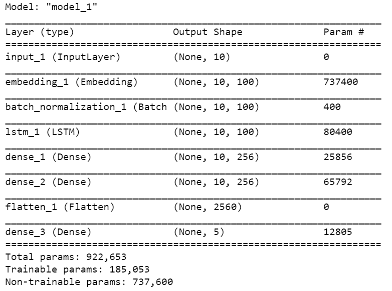

# Depression_Detection

A deep learning project used to predict the level of depression faced by users based on their responses to a questionnaire. Work is currently being done to incorporate a more passive approach, wherein the user's involvement in the depression detection would be minimal, and more effective in practise. We plan to make this a widely available mobile application, developed on Flutter that can address a wide range of design issues such as privacy, reliability and efficiency. 

# Data

The data used for this project was obtained from the DAIC-WOZ interviews conducted by the University of Southern California. 
http://dcapswoz.ict.usc.edu/

Our project mainly focuses on analyzing the textual transcripts offered by the database. 
These transcripts contain the interactions between the participants and a virtual agent called "Ellie". This agent is controlled by an interviewer outside of the room under consideration. The questionnaire asked by the interviewers is based on the Patient Health Questionnaire (PHQ) list of questions, and are asked fairly dynamically, and change according to the responses of the user. 

# Baseline
DL4DED: Deep Learning for Depressive Episode Detection on Mobile Devices \
Approach: On device ML audio processing using CNN (spectrograms) and LSTM multimodal architecture. \
Accuracy: 52% \
Power Consumption: 5 mAh* \
Privacy: ensured, no user data transmitted to servers \
\
*depending on the phone specifications \
https://link.springer.com/chapter/10.1007/978-3-030-32785-9_10

# Preprocessing

1) The answers provided by participants are subjected to removal of stopwords and optionally stemming/lemmatization, and converted into a list of words. 
2) Tokenization of words is done, after collecting the entire vocabulary of all words used in the answers.
3) The list of words thus obtained is split into several lists by using a sliding window of size 10.
4) For lists (after windowing) that have lower than 10 words, the corresponding tokens list is padded with zeros.
5) We use GloVe embeddings for our model, specifically the embeddings characterized by 6 billion tokens, 400k vocabulary of words and 100 dimensional vectors. A 2-D array is formed that stores the vectors for every word in the answers vocabulary (after removing stopwords).

# Model Architecture

# Hyperparameters

Window Size: 10 \
Epochs: 30, with Early Stopping Criterion - monitoring on Validation Loss \
Batch Size: 64 \
Optimizer: Adam \
Loss: Categorical Cross Entropy \

# Results

* currently being written
